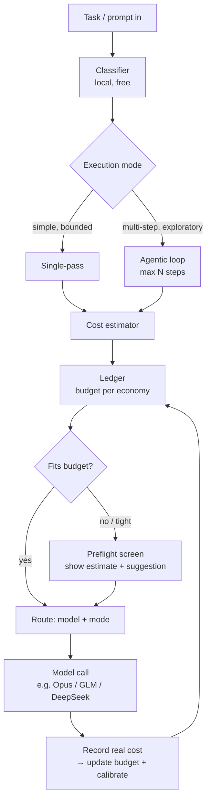
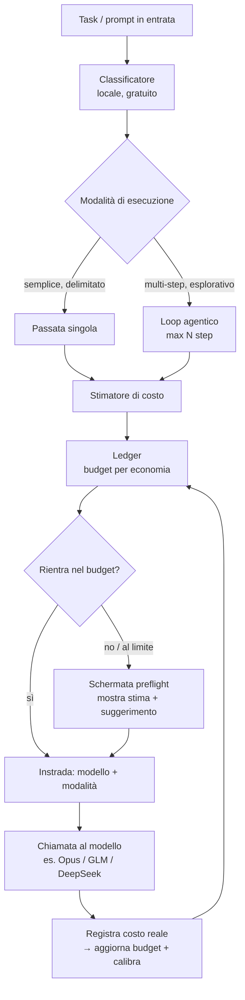

# Tare

**[🇬🇧 English](#english) · [🇮🇹 Italiano](#italiano)**

> Status: design spec / pre-alpha. This README is the build brief.
> Working name — the _tare_ is the empty weight a scale measures before you load anything onto it. That's what this tool does: it weighs the cost of a task before you commit to it.

---

<a id="english"></a>

## 🇬🇧 English

**Know what a task costs before you run it.**
Budget-aware preflight for AI coding agents — it decides _single-pass vs. agentic_, estimates token & quota cost across your models, and routes the task within budget _before_ execution begins.

### In plain terms

If you use more than one AI model to keep your costs down, you're constantly making two judgment calls in your head before every task: _how much work does this actually need?_ and _which budget should pay for it?_ Get either wrong and you waste money or burn through a quota you were saving.

Tare makes those two calls for you, automatically, **before the task runs** — and shows you the estimated price so you can approve it or change your mind. Think of it as a pre-flight checklist for your AI spending: a quick check that happens before takeoff, not a bill you read after landing.

### TL;DR

Today's multi-model setups route **reactively**: they pick a model by the _type_ of request and only react _after_ you've already hit a wall. Tare adds the missing step — a **preflight** that, before a task runs:

1. **Classifies** how heavy the task is, using a free judge that runs on your own machine.
2. **Decides the execution mode** — does this need a full step-by-step agentic loop, or is a single pass enough?
3. **Estimates** the token and quota cost on each of your models.
4. **Routes within budget** and shows you the number _before_ you spend it.

One screen, one decision, then it runs. That's the whole product.

### The problem

If you run several models to control cost, you already do this math in your head all day. Two things make it hard.

**First: some tasks need a loop, and loops are expensive.** When an AI agent works "agentically," it goes step by step — reading a file, running a command, re-planning, editing, checking again. The catch is that **each step re-sends everything it has seen so far**, so the token count snowballs as the task goes on. A quick, well-defined task doesn't need any of this: one clean pass ("single-pass") does the job for a fraction of the cost. Sending a simple task through a full agentic loop is one of the easiest ways to waste money — and you usually only notice afterwards.

**Second: your budget isn't one pot of money — it's three different kinds at once.**

- A **subscription cap** — a flat plan with a hard ceiling you can't exceed (e.g. an Opus-class plan that runs out for the week once you hit the limit).
- A **tiered quota** — a "Lite" plan that gives you an allowance and then throttles or stops you at a threshold.
- **Metered credits** — pay-per-token: no ceiling, but every single call costs real money.

A 12% slice of a weekly quota, a 0.4% dent in a subscription cap, and three cents of metered credit can't be compared by raw token count. They cost you different things. Deciding which one should pay for a given task — while keeping enough headroom in each — is exactly the kind of bookkeeping nobody wants to do by hand.

Existing routers don't help with either problem. They translate request formats, pick a model by category (`default` / `background` / `think` / `longContext`), and fall back when a provider errors out. None of them **predict** the cost, and none of them choose the **execution mode**. You find out you overspent _after_ the fact.

Tare is the check that runs first.

### What Tare does

```
  Incoming task
       │
       ▼
  ┌─────────────────────────────────────────────────────────┐
  │  PREFLIGHT (runs locally, before any paid call)          │
  │                                                          │
  │  1. Classify   → how heavy? how many agentic steps?      │
  │  2. Decide     → single-pass | agentic (max N steps)     │
  │  3. Estimate   → tokens + cost on each candidate model   │
  │  4. Check      → budget left in each economy             │
  │  5. Route      → model + mode that fits the budget       │
  └─────────────────────────────────────────────────────────┘
       │
       ▼
  ┌─────────────────────────────────────────────────────────┐
  │  "Looks agentic, ~40k tokens.                            │
  │   On GLM-Lite that's ~12% of your weekly quota.          │
  │   Suggested: single-pass on DeepSeek (~$0.03).           │
  │   [Run as suggested]  [Run anyway]  [Override]"          │
  └─────────────────────────────────────────────────────────┘
       │
       ▼
  Execute on the chosen model → record what it actually cost
```

The key moment is the second box: you see the price tag **before** you pay it. After the run, Tare compares the real cost to its estimate and uses the difference to get better next time.

### A concrete walkthrough

You ask your coding agent: _"find why the checkout test is failing and fix it."_

Before anything runs, Tare's preflight kicks in:

- **Classify** — this is open-ended debugging across files you haven't named. The local judge tags it `agentic`, roughly 6–9 steps, token band 30k–55k, confidence 0.6.
- **Estimate** — on your tiered "Lite" model that band is ~10–14% of your remaining weekly quota; on your metered model it's ~$0.02–0.04; your Opus-class plan has only 18% of its weekly cap left.
- **Decide** — your policy says keep the Opus-class cap above 20% headroom, so it's off the table this week. The Lite model has room but this would eat a big slice; the metered model is cheap and has no ceiling.
- **Preflight** — Tare shows you: _"Agentic debug, ~40k tokens. Lite model: ~12% of weekly quota. Suggested: metered model, ~$0.03. [Run suggested] [Use Lite] [Override]."_

You hit **Run suggested**. The task runs on the metered model. Afterwards Tare records what it _actually_ cost (say 36k tokens / $0.028) and tightens its next estimate.

Without Tare, you'd have found out about the quota hit only after it happened — or burned the Opus headroom you were deliberately saving for harder architecture work later in the week.

### How it works



Tare sits in the same place a router would — either as a **local proxy** on a loopback port that your agent talks to instead of talking to the model directly, or as a **pre-task hook / MCP tool** the agent calls before it starts. Install friction stays near zero: nothing in your normal workflow changes, except that a short preflight screen appears before expensive tasks.

### Architecture

Five small components. There's no framework here — each piece does exactly one job, and you could explain any of them in a sentence.

**1. Interceptor — the part that catches the task.** It sits between your coding agent and the models, so it can see a task before it runs. Two shapes:

- _Proxy mode_ — opens a loopback port (e.g. `127.0.0.1:3210`), speaks the standard Anthropic Messages / OpenAI-compatible format, and forwards to whichever model is chosen. This is the same integration pattern routers already use, so any tool that lets you set a custom base URL just works.
- _Hook / MCP mode_ — registers a step the agent runs before starting a task, which returns the routing decision and the estimate.

**2. Classifier — the part that sizes the task.** A lightweight judge that reads the task and answers: how complex is it, single-pass or agentic, roughly how many steps, and roughly how many tokens. It runs **on your own machine and for free** — ideally on a small local model you already serve (via Ollama, llama.cpp, or any local GGUF endpoint). This is deliberate: a tool whose job is to save you money can't itself cost money — or send your code to a third party — every time it makes a decision. It starts with simple, transparent rules and gets sharper as it learns from your own session history.

```jsonc
// input
{ "task": "<prompt>", "context_tokens": 8200, "tools_available": ["edit","bash","grep"] }
// output
{ "mode": "agentic", "expected_steps": 7, "token_band": [28000, 52000], "confidence": 0.62 }
```

**3. Cost estimator — the part that turns "how heavy" into "how much".** It takes the classifier's answer and projects a cost for each model, accounting for the snowballing context of an agentic loop, then maps it onto that model's economy: a percentage of a subscription cap, a percentage of a tiered quota, or an amount of metered money. It always returns a **range, not a single number**, with a stated confidence — because pretending to know the exact cost would be dishonest (more on this below).

**4. Ledger — the part nobody else has.** A small file that tracks **how much budget is left in each economy**:

```jsonc
{
  "models": {
    "opus": { "economy": "subscription_cap", "period": "weekly", "cap": 100, "used": 41 },
    "glm-lite": { "economy": "tiered_quota", "period": "weekly", "cap": 100, "used": 73 },
    "deepseek": { "economy": "metered", "currency": "USD", "spent": 2.14 },
  },
}
```

It's updated after each run with what the task _actually_ cost (read from the model's own usage reporting where available), so the budget picture stays honest and the estimates keep improving.

**5. Router — the part that makes the call.** Given the cost ranges, the current budget, and a small set of rules you control, it picks the **model + mode** that fits, and produces the preflight screen. The rules are plain and editable, for example: _"keep the Opus cap above 20% headroom for the week," "prefer single-pass under 15k tokens," "don't spend metered money while a capped model still has room."_

### The two decisions, in detail

**Execution mode: single-pass vs. agentic.** This is the axis existing routers ignore entirely — they only ask _what type_ of request this is, never _how much machinery it needs_.

- _Single-pass_ is bounded, well-specified work: a focused edit, a code review, a critique, a translation, a docstring pass. One request, no loop — cheap and predictable.
- _Agentic_ is open-ended, exploratory work: a refactor spanning several files, debugging a failure you can't yet locate, scaffolding a new feature. The agent reads, plans, edits and re-checks in a loop, and because the context grows with every step, this is where quota quietly disappears.

Routing the wrong task into the wrong mode is the single biggest source of wasted spend. Tare's job is to call it _before_ the loop starts.

**Budget: route across three economies.** As described above, the three kinds of budget aren't comparable by token count — they're comparable by _what they cost you in remaining headroom_. The ledger normalizes them onto the same scale, so the router can reason about which budget can absorb a given task most cheaply right now, while respecting the headroom rules you've set.

### Estimation honesty

Agentic cost is genuinely hard to predict, because you can't know in advance how many steps the loop will take. Tare doesn't pretend otherwise:

- Every estimate is a **range** with a **confidence level**, never a fake-precise single number.
- Ranges start wide (e.g. ±30%) and **narrow as the classifier learns from your runs**.
- After each task, predicted vs. actual is recorded; big misses lower the confidence and feed back into the classifier so it does better next time.

A tool that says "between 28k and 52k tokens, confidence 0.6" and is right about the range is far more useful than one that says "41,000 tokens" and is quietly wrong. Trust comes from never overstating what it knows.

### Quickstart (target experience)

```bash
# install
npm install -g tare        # or: brew install tare

# point your agent at the proxy (example: an agent that accepts a custom base URL)
export ANTHROPIC_BASE_URL=http://127.0.0.1:3210
tare up                    # starts the proxy + ledger + local classifier

# configure once
tare init                  # writes ~/.tare/config.jsonc with your models + budgets
```

From then on, expensive tasks show a preflight screen; cheap ones can be set to pass automatically.

### Configuration (example)

```jsonc
// ~/.tare/config.jsonc
{
  // Candidate models, one per economy. `base_url` is used by the proxy (M4).
  "models": {
    "opus": {
      "economy": "subscription_cap",
      "period": "weekly",
      "tokenCapacity": 1000000,
      "base_url": "…",
    },
    "glm-lite": {
      "economy": "tiered_quota",
      "period": "weekly",
      "tokenCapacity": 2000000,
      "base_url": "…",
    },
    "deepseek": {
      "economy": "metered",
      "currency": "USD",
      "priceInPerMillion": 0.27,
      "priceOutPerMillion": 0.41,
      "base_url": "…",
    },
  },
  // The rules you control.
  "policy": {
    "singlePassBelowTokens": 15000,
    "opusMinHeadroomPct": 20,
    "preferCappedOverMetered": true,
    "autoPassCostBelow": { "meteredUsd": 0.01 },
  },
  // Coming in M4 — not read by the loader yet:
  "classifier": {
    "backend": "local", // local GGUF judge. free, private, runs on your machine.
    "endpoint": "http://127.0.0.1:8080/v1/chat/completions",
    "calibrate_from": "~/.tare/logs",
  },
  "preflight": {
    "always_prompt_when": ["agentic", "metered_spend", "tight_budget"],
    "auto_pass_when": ["single_pass", "cheap"],
  },
}
```

### What Tare is _not_ (and how it differs)

|                                          | Existing routers    | **Tare**                 |
| ---------------------------------------- | ------------------- | ------------------------ |
| Picks a model by request type            | ✅                  | ✅                       |
| Falls back when a provider errors        | ✅                  | ✅                       |
| **Predicts the cost before running**     | ❌                  | ✅                       |
| **Decides single-pass vs. agentic**      | ❌                  | ✅                       |
| **Tracks budget across mixed economies** | partial usage stats | ✅ one normalized ledger |
| **Shows you the price before you pay**   | ❌                  | ✅                       |
| Free local classifier                    | ❌                  | ✅                       |
| Learns from your own history             | ❌                  | ✅                       |

Tare is **not** a gateway, not a credentials manager, and not a way to use a coding agent without an account. It's a preflight. If a router already moves your requests around, Tare sits one layer above it and decides _whether and how_ to spend before the router ever sees the request. The two work together.

### Roadmap

**MVP — the only thing that matters first:** the proxy interceptor on loopback; a local rule-based classifier (mode + token range); the ledger for the three economies; the preflight screen with estimate and suggestion; recording of real cost after each run; and exactly **three** models — one capped, one tiered, one metered. Three, not forty.

**v0.2:** the classifier learns from real session history; confidence ranges narrow from predicted-vs-actual data; an editable rules format.

**Later:** hook / MCP mode alongside proxy mode; more models and shareable presets; per-project budgets and weekly spending reports.

The discipline is to ship an MVP that does one thing completely, and earn every later feature from real use.

### FAQ

**Isn't this just a duplicate of the router I already use?** No. Routers decide _which model_ and react _after_ you've spent. Tare decides _whether and how_ to spend, _before_. Run both — router underneath, Tare on top.

**How can it estimate agentic cost if it can't know how many steps there'll be?** It can't exactly, so it doesn't pretend to. It gives a calibrated range with a confidence level, and that range tightens as it learns from your runs.

**Why does the classifier run locally?** Because a tool whose whole purpose is to save you money can't itself cost money — or leak your code — every time it makes a decision. Running it locally keeps it free and private, and a small local model is more than capable of sizing a task.

**Will the estimate ever be wrong?** Yes, and it'll tell you when it's unsure. The goal is an honest range, not false precision.

### Contributing

This is a focused tool, not a framework. Pull requests that keep it small, sharp, and honest are welcome. Issues that report a gap between the estimate and the real cost (with logs) are especially valuable — that's the data that makes the classifier good.

### License

MIT (proposed).

---

<a id="italiano"></a>

## 🇮🇹 Italiano

**Sai quanto costa un task prima di lanciarlo.**
Preflight budget-aware per agenti di coding AI — decide _passata singola vs. agentico_, stima il costo in token e quota sui tuoi modelli, e instrada il task entro il budget _prima_ che l'esecuzione cominci.

### In parole semplici

Se usi più di un modello AI per tenere bassi i costi, prima di ogni task fai di continuo due valutazioni a mente: _quanto lavoro serve davvero?_ e _quale budget deve pagarlo?_ Sbagliarne una significa sprecare soldi o consumare una quota che stavi tenendo da parte.

Tare prende quelle due decisioni al posto tuo, in automatico, **prima che il task parta** — e ti mostra il prezzo stimato così puoi approvarlo o cambiare idea. Pensalo come una checklist pre-volo per la tua spesa AI: un controllo veloce che avviene prima del decollo, non un conto che leggi dopo l'atterraggio.

### In due righe

I setup multi-modello di oggi instradano in modo **reattivo**: scelgono il modello in base al _tipo_ di richiesta e reagiscono solo _dopo_ aver già sbattuto contro il muro. Tare aggiunge il passaggio mancante — un **preflight** che, prima che un task parta:

1. **Classifica** quanto è pesante il task, con un giudice gratuito che gira sulla tua macchina.
2. **Decide la modalità di esecuzione** — serve un loop agentico passo-passo o basta una passata singola?
3. **Stima** il costo in token e quota su ciascuno dei tuoi modelli.
4. **Instrada entro il budget** e ti mostra il numero _prima_ che tu lo spenda.

Una schermata, una decisione, poi parte. È tutto qui il prodotto.

### Il problema

Se usi diversi modelli per controllare i costi, questo calcolo lo fai già a mente tutto il giorno. Due cose lo rendono difficile.

**Primo: alcuni task hanno bisogno di un loop, e i loop costano.** Quando un agente AI lavora in modo "agentico", procede passo dopo passo — legge un file, esegue un comando, ripianifica, modifica, ricontrolla. Il punto è che **a ogni step rimanda tutto quello che ha visto fino a quel momento**, quindi il conteggio dei token cresce a valanga man mano che il task avanza. Un task rapido e ben definito non ha bisogno di tutto questo: una sola passata pulita ("passata singola") fa il lavoro a una frazione del costo. Mandare un task semplice in un loop agentico completo è uno dei modi più facili di sprecare soldi — e di solito te ne accorgi solo dopo.

**Secondo: il tuo budget non è un'unica cassa — sono tre tipi diversi insieme.**

- Un **cap di abbonamento** — un piano fisso con un tetto rigido che non puoi superare (es. un piano di classe Opus che per quella settimana si esaurisce una volta raggiunto il limite).
- Una **quota a scaglioni** — un piano "Lite" che ti dà un'allocazione e poi ti rallenta o ti blocca a una soglia.
- **Crediti a consumo** — paghi per token: nessun tetto, ma ogni singola chiamata costa soldi veri.

Un 12% di una quota settimanale, uno 0,4% intaccato su un cap di abbonamento e tre centesimi di credito a consumo non si possono confrontare per numero grezzo di token. Ti costano cose diverse. Decidere quale dei tre deve pagare un certo task — mantenendo abbastanza margine in ciascuno — è esattamente il tipo di contabilità che nessuno vuole fare a mano.

I router esistenti non aiutano in nessuno dei due problemi. Traducono i formati delle richieste, scelgono il modello per categoria (`default` / `background` / `think` / `longContext`) e fanno fallback quando un provider dà errore. Nessuno **predice** il costo, e nessuno sceglie la **modalità di esecuzione**. Scopri di aver speso troppo _a cose fatte_.

Tare è il controllo che gira per primo.

### Cosa fa Tare

```
  Task in entrata
       │
       ▼
  ┌─────────────────────────────────────────────────────────┐
  │  PREFLIGHT (gira in locale, prima di ogni chiamata a pagamento) │
  │                                                          │
  │  1. Classifica → quanto pesa? quanti step agentici?      │
  │  2. Decide     → passata singola | agentico (max N step) │
  │  3. Stima      → token + costo su ogni modello candidato │
  │  4. Verifica   → budget residuo in ogni economia         │
  │  5. Instrada   → modello + modalità che rientra nel budget│
  └─────────────────────────────────────────────────────────┘
       │
       ▼
  ┌─────────────────────────────────────────────────────────┐
  │  "Sembra agentico, ~40k token.                           │
  │   Su GLM-Lite è ~12% della tua quota settimanale.        │
  │   Suggerito: passata singola su DeepSeek (~$0,03).       │
  │   [Esegui come suggerito]  [Esegui comunque]  [Modifica]"│
  └─────────────────────────────────────────────────────────┘
       │
       ▼
  Esegui sul modello scelto → registra quanto è costato davvero
```

Il momento chiave è il secondo riquadro: vedi il prezzo **prima** di pagarlo. Dopo l'esecuzione, Tare confronta il costo reale con la sua stima e usa la differenza per migliorare la volta successiva.

### Un esempio concreto

Chiedi al tuo agente di coding: _"trova perché il test del checkout fallisce e correggilo"._

Prima che parta qualsiasi cosa, scatta il preflight di Tare:

- **Classifica** — è un debug aperto su file che non hai nominato. Il giudice locale lo etichetta `agentico`, circa 6–9 step, fascia di token 30k–55k, confidenza 0,6.
- **Stima** — sul tuo modello "Lite" a scaglioni quella fascia è ~10–14% della quota settimanale residua; sul modello a consumo è ~$0,02–0,04; il tuo piano di classe Opus ha solo il 18% di cap settimanale rimasto.
- **Decide** — la tua policy dice di tenere il cap Opus sopra il 20% di margine, quindi questa settimana è fuori gioco. Il modello Lite ha spazio ma questo task ne mangerebbe una bella fetta; il modello a consumo è economico e senza tetto.
- **Preflight** — Tare ti mostra: _"Debug agentico, ~40k token. Modello Lite: ~12% della quota settimanale. Suggerito: modello a consumo, ~$0,03. [Esegui suggerito] [Usa Lite] [Modifica]."_

Premi **Esegui suggerito**. Il task gira sul modello a consumo. Dopo, Tare registra quanto è costato _davvero_ (diciamo 36k token / $0,028) e stringe la stima successiva.

Senza Tare, avresti scoperto il colpo alla quota solo dopo che era successo — o avresti bruciato il margine di Opus che stavi tenendo apposta per il lavoro di architettura più difficile più avanti nella settimana.

### Come funziona



Tare sta nello stesso punto in cui starebbe un router — o come **proxy locale** su una porta di loopback con cui il tuo agente parla invece di parlare direttamente col modello, o come **hook pre-task / tool MCP** che l'agente chiama prima di iniziare. L'attrito d'installazione resta vicino allo zero: nel tuo flusso di lavoro normale non cambia nulla, tranne che prima dei task costosi compare una breve schermata di preflight.

### Architettura

Cinque componenti piccoli. Qui non c'è nessun framework — ogni pezzo fa esattamente un lavoro, e potresti spiegare ognuno in una frase.

**1. Interceptor — il pezzo che intercetta il task.** Sta tra il tuo agente di coding e i modelli, così può vedere un task prima che venga eseguito. Due forme:

- _Modalità proxy_ — apre una porta di loopback (es. `127.0.0.1:3210`), parla lo standard Anthropic Messages / OpenAI-compatible, e inoltra al modello scelto. È lo stesso schema d'integrazione che i router già usano, quindi qualsiasi strumento che ti permette di impostare una base URL personalizzata funziona da subito.
- _Modalità hook / MCP_ — registra un passaggio che l'agente esegue prima di iniziare un task, che restituisce la decisione di routing e la stima.

**2. Classificatore — il pezzo che misura il task.** Un giudice leggero che legge il task e risponde: quanto è complesso, passata singola o agentico, all'incirca quanti step, e all'incirca quanti token. Gira **sulla tua macchina e gratis** — idealmente su un piccolo modello locale che già servi (via Ollama, llama.cpp, o un qualsiasi endpoint GGUF locale). È una scelta voluta: uno strumento il cui compito è farti risparmiare non può a sua volta costarti — o mandare il tuo codice a terzi — a ogni decisione. Parte da regole semplici e trasparenti e diventa più preciso man mano che impara dal tuo storico di sessioni.

```jsonc
// input
{ "task": "<prompt>", "context_tokens": 8200, "tools_available": ["edit","bash","grep"] }
// output
{ "mode": "agentic", "expected_steps": 7, "token_band": [28000, 52000], "confidence": 0.62 }
```

**3. Stimatore di costo — il pezzo che trasforma "quanto pesa" in "quanto costa".** Prende la risposta del classificatore e proietta un costo per ogni modello, tenendo conto del contesto a valanga di un loop agentico, poi lo mappa sull'economia di quel modello: una percentuale di un cap di abbonamento, una percentuale di una quota a scaglioni, o un importo di denaro a consumo. Restituisce sempre una **fascia, non un singolo numero**, con una confidenza dichiarata — perché fingere di conoscere il costo esatto sarebbe disonesto (sotto, di più).

**4. Ledger — il pezzo che nessun altro ha.** Un piccolo file che traccia **quanto budget resta in ogni economia**:

```jsonc
{
  "models": {
    "opus": { "economy": "subscription_cap", "period": "weekly", "cap": 100, "used": 41 },
    "glm-lite": { "economy": "tiered_quota", "period": "weekly", "cap": 100, "used": 73 },
    "deepseek": { "economy": "metered", "currency": "USD", "spent": 2.14 },
  },
}
```

Viene aggiornato dopo ogni esecuzione con quanto il task è costato _davvero_ (letto dal reporting di usage del modello, dove disponibile), così il quadro del budget resta onesto e le stime continuano a migliorare.

**5. Router — il pezzo che prende la decisione.** Date le fasce di costo, il budget attuale e un piccolo insieme di regole che controlli tu, sceglie il **modello + modalità** che rientra, e produce la schermata di preflight. Le regole sono semplici e modificabili, per esempio: _"tieni il cap di Opus sopra il 20% di margine per la settimana", "preferisci la passata singola sotto i 15k token", "non spendere denaro a consumo finché un modello con cap ha ancora spazio"._

### Le due decisioni, nel dettaglio

**Modalità di esecuzione: passata singola vs. agentico.** È l'asse che i router esistenti ignorano del tutto — chiedono solo _che tipo_ di richiesta sia, mai _quanta macchina serva_.

- _Passata singola_ è lavoro delimitato e ben specificato: una modifica mirata, una review del codice, una critica, una traduzione, una passata sui docstring. Una richiesta, niente loop — economico e prevedibile.
- _Agentico_ è lavoro aperto ed esplorativo: un refactor su più file, il debug di un errore che non riesci ancora a localizzare, lo scaffolding di una nuova feature. L'agente legge, pianifica, modifica e ricontrolla in loop, e poiché il contesto cresce a ogni step, è qui che la quota sparisce in silenzio.

Mandare il task sbagliato nella modalità sbagliata è la prima fonte di spesa sprecata. Il compito di Tare è deciderlo _prima_ che il loop parta.

**Budget: instradare fra tre economie.** Come detto sopra, i tre tipi di budget non sono confrontabili per numero di token — sono confrontabili per _quanto ti costano in margine residuo_. Il ledger li normalizza sulla stessa scala, così il router può ragionare su quale budget può assorbire un dato task nel modo più economico in quel momento, rispettando le regole di margine che hai impostato.

### Onestà sulle stime

Il costo agentico è davvero difficile da prevedere, perché non puoi sapere in anticipo quanti step farà il loop. Tare non finge il contrario:

- Ogni stima è una **fascia** con un **livello di confidenza**, mai un singolo numero finto-preciso.
- Le fasce partono ampie (es. ±30%) e si **restringono man mano che il classificatore impara dalle tue esecuzioni**.
- Dopo ogni task, previsto vs. reale viene registrato; gli scarti grandi abbassano la confidenza e rientrano nel classificatore così fa meglio la volta dopo.

Uno strumento che dice "tra 28k e 52k token, confidenza 0,6" ed è giusto sulla fascia è molto più utile di uno che dice "41.000 token" e si sbaglia in silenzio. La fiducia nasce dal non sovrastimare mai ciò che si sa.

### Avvio rapido (esperienza obiettivo)

```bash
# installa
npm install -g tare        # oppure: brew install tare

# punta il tuo agente al proxy (esempio: un agente che accetta una base URL personalizzata)
export ANTHROPIC_BASE_URL=http://127.0.0.1:3210
tare up                    # avvia proxy + ledger + classificatore locale

# configura una volta sola
tare init                  # scrive ~/.tare/config.jsonc con i tuoi modelli + budget
```

Da lì in poi, i task costosi mostrano una schermata di preflight; quelli economici si possono impostare in passaggio automatico.

### Configurazione (esempio)

```jsonc
// ~/.tare/config.jsonc
{
  // Modelli candidati, uno per economia. `base_url` è usato dal proxy (M4).
  "models": {
    "opus": {
      "economy": "subscription_cap",
      "period": "weekly",
      "tokenCapacity": 1000000,
      "base_url": "…",
    },
    "glm-lite": {
      "economy": "tiered_quota",
      "period": "weekly",
      "tokenCapacity": 2000000,
      "base_url": "…",
    },
    "deepseek": {
      "economy": "metered",
      "currency": "USD",
      "priceInPerMillion": 0.27,
      "priceOutPerMillion": 0.41,
      "base_url": "…",
    },
  },
  // Le regole che controlli tu.
  "policy": {
    "singlePassBelowTokens": 15000,
    "opusMinHeadroomPct": 20,
    "preferCappedOverMetered": true,
    "autoPassCostBelow": { "meteredUsd": 0.01 },
  },
  // In arrivo (M4) — non ancora letti dal loader:
  "classifier": {
    "backend": "local", // giudice GGUF locale. gratuito, privato, gira sulla tua macchina.
    "endpoint": "http://127.0.0.1:8080/v1/chat/completions",
    "calibrate_from": "~/.tare/logs",
  },
  "preflight": {
    "always_prompt_when": ["agentic", "metered_spend", "tight_budget"],
    "auto_pass_when": ["single_pass", "cheap"],
  },
}
```

### Cosa Tare _non_ è (e in cosa si distingue)

|                                            | Router esistenti              | **Tare**                       |
| ------------------------------------------ | ----------------------------- | ------------------------------ |
| Sceglie il modello per tipo di richiesta   | ✅                            | ✅                             |
| Fa fallback all'errore del provider        | ✅                            | ✅                             |
| **Predice il costo prima di eseguire**     | ❌                            | ✅                             |
| **Decide passata singola vs. agentico**    | ❌                            | ✅                             |
| **Traccia il budget fra economie diverse** | statistiche di usage parziali | ✅ un solo ledger normalizzato |
| **Ti mostra il prezzo prima di pagare**    | ❌                            | ✅                             |
| Classificatore locale gratuito             | ❌                            | ✅                             |
| Impara dal tuo storico                     | ❌                            | ✅                             |

Tare **non** è un gateway, non è un gestore di credenziali, e non è un modo per usare un agente di coding senza account. È un preflight. Se un router muove già le tue richieste, Tare sta un livello sopra e decide _se e come_ spendere prima ancora che il router veda la richiesta. I due lavorano insieme.

### Roadmap

**MVP — l'unica cosa che conta all'inizio:** l'interceptor proxy su loopback; un classificatore locale a regole (modalità + fascia di token); il ledger per le tre economie; la schermata di preflight con stima e suggerimento; la registrazione del costo reale dopo ogni esecuzione; ed esattamente **tre** modelli — uno a cap, uno a scaglioni, uno a consumo. Tre, non quaranta.

**v0.2:** il classificatore impara dallo storico reale di sessioni; le fasce di confidenza si restringono dai dati previsto-vs-reale; un formato di regole modificabile.

**Più avanti:** modalità hook / MCP accanto a quella proxy; più modelli e preset condivisibili; budget per progetto e report settimanali di spesa.

La disciplina è rilasciare un MVP che fa una cosa sola in modo completo, e guadagnarsi ogni feature successiva dall'uso reale.

### FAQ

**Non è solo un doppione del router che già uso?** No. I router decidono _quale modello_ e reagiscono _dopo_ che hai speso. Tare decide _se e come_ spendere, _prima_. Usali insieme — il router sotto, Tare sopra.

**Come fa a stimare il costo agentico se non può sapere quanti step ci saranno?** Non può con esattezza, e infatti non finge. Dà una fascia calibrata con un livello di confidenza, e quella fascia si stringe man mano che impara dalle tue esecuzioni.

**Perché il classificatore gira in locale?** Perché uno strumento il cui scopo è farti risparmiare non può a sua volta costarti — o esporre il tuo codice — a ogni decisione. Tenerlo in locale lo mantiene gratuito e privato, e un piccolo modello locale è più che capace di misurare un task.

**La stima sarà mai sbagliata?** Sì, e ti dirà quando è incerta. L'obiettivo è una fascia onesta, non una falsa precisione.

### Contribuire

Uno strumento focalizzato, non un framework. Le pull request che lo mantengono piccolo, affilato e onesto sono benvenute. Le issue che segnalano uno scarto tra la stima e il costo reale (con i log) sono particolarmente preziose: sono i dati che rendono buono il classificatore.

### Licenza

MIT (proposta).
