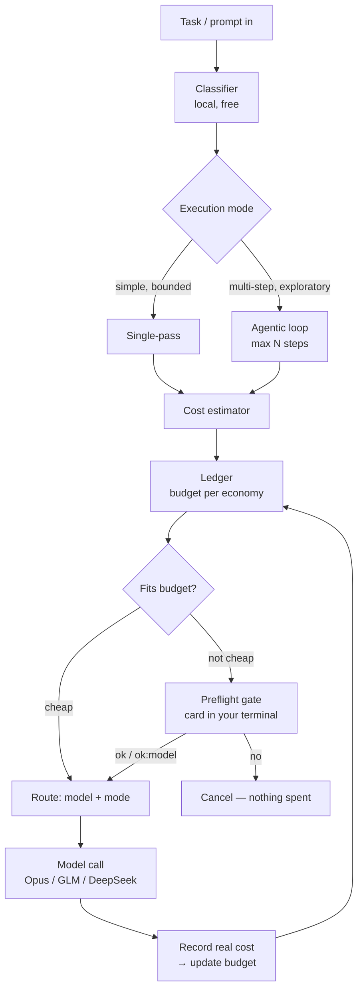

# Tare

**Your Claude subscription and your pay-per-token APIs, competing in one budget — and you see the price before you press enter.**

<sub>🇮🇹 [Leggi in italiano](README.it.md)</sub>

Tare is a budget-aware preflight for AI coding agents. It sits between your agent (Claude Code, or anything that accepts a custom base URL) and your models, and before an expensive task runs it shows you a card — right in your agent's terminal — with the estimated price on each of your economies. You reply `ok`, pick a cheaper model, or cancel. Then it runs.

The point most routers miss: your **Pro/Max subscription** and your **metered APIs** (DeepSeek, GLM/z.ai, …) are different kinds of money that can't be compared by token count. Tare puts them in **one normalized ledger** so a task can be paid by whichever budget costs you least right now — and it asks you first.

```
⚖️ tare — preflight
  agentic · ~8 step · 180k–260k token · confidence 70%

  → glm-lite     3%–5% of weekly quota · agentic   ← chosen
  → deepseek     0.03 USD–0.05 USD · agentic
  → opus         11%–14% of weekly cap · agentic

  reply:  ok  ·  ok:<model>  ·  no
```

<sub>The card above is Tare's real output. It appears in your agent's own terminal — reply `ok` to run, `ok:deepseek` to switch economy, `no` to cancel at zero cost.</sub>

---

## What works today

- **Loopback proxy interceptor** speaking the Anthropic Messages format — streaming (SSE) and non-streaming — that any agent talks to via `ANTHROPIC_BASE_URL`. Nothing else in your workflow changes.
- **Multi-provider routing** across three economies at once: your **Pro/Max subscription** (Claude Code's OAuth is forwarded untouched — no key needed) and third-party **Anthropic-compatible APIs** (DeepSeek, GLM/z.ai) behind Bearer keys. Tested live end-to-end against Claude, GLM and DeepSeek.
- **One normalized ledger** across subscription cap, tiered quota and metered spend, updated after each run from the provider's own usage reporting.
- **Local, free classifier** — deterministic, transparent rules that size a task (mode, role, token band) on your own machine. No network call, no code leaving your box, no cost to decide.
- **The in-band preflight gate** — when a task isn't cheap enough to auto-pass, Tare answers with the card above instead of forwarding, and waits for your `ok` / `ok:<model>` / `no`. One approval per task; the agentic loop then runs without asking again.
- **A model for writing, a model for reviewing** — with `roleRouting: "strict"`, review tasks and write tasks draw on separate budgets. Cap a small "Lite" plan to `single_pass` so an agentic loop can never drain it.
- **Force a model on the fly** — `[model:NAME]` in a prompt for one request, or `tare use <name>` / `tare auto` to pin persistently, no restart.
- **CLI**: `tare init · up · status · use · auto`.

**Known limitation:** some providers (GLM/z.ai) don't always report `input_tokens` the way Anthropic does, so input accounting for those models is currently partial. Estimates stay honest ranges; this narrows as provider reporting improves.

## Install

```bash
npm install -g @gcardinale/tare

tare init                                 # writes ~/.tare/config.jsonc + ledger
export ANTHROPIC_BASE_URL=http://127.0.0.1:3210
tare up                                   # starts the proxy + ledger + classifier
```

Point your coding agent at `http://127.0.0.1:3210` and work as usual. Expensive tasks show the preflight card; cheap ones can auto-pass silently.

## How it differs from a router

|                                          | Existing routers    | **Tare**                 |
| ---------------------------------------- | ------------------- | ------------------------ |
| Picks a model by request type            | ✅                  | ✅                       |
| Falls back when a provider errors        | ✅                  | ✅                       |
| **Predicts the cost before running**     | ❌                  | ✅                       |
| **Decides single-pass vs. agentic**      | ❌                  | ✅                       |
| **Tracks budget across mixed economies** | partial usage stats | ✅ one normalized ledger |
| **Asks you before it spends**            | ❌                  | ✅ in-band gate          |
| Free local classifier                    | ❌                  | ✅                       |

Tare is **not** a gateway, a credentials manager, or a way to use an agent without an account. It's a preflight. If a router already moves your requests around, Tare sits one layer above it and decides _whether and how_ to spend before the router ever sees the request. The two work together.

## Why this matters now

An agent working "agentically" goes step by step — read a file, run a command, re-plan, edit, re-check — and **each step re-sends everything it has seen so far**, so token cost snowballs. A quick, well-defined task doesn't need any of that: one clean pass does the job for a fraction of the cost. Sending a simple task through a full agentic loop is one of the easiest ways to waste money, and you usually only notice afterwards.

Meanwhile your budget isn't one pot — it's three at once:

- **Subscription cap** — a flat plan with a hard weekly/monthly ceiling (e.g. an Opus-class plan).
- **Tiered quota** — a "Lite" allowance that throttles or stops at a threshold.
- **Metered credits** — pay-per-token: no ceiling, but every call costs real money.

A 12% slice of a weekly quota, a 0.4% dent in a subscription cap, and three cents of metered credit can't be compared by raw tokens — they cost you different things. Deciding which one pays for a task, while keeping headroom in each, is exactly the bookkeeping nobody wants to do by hand. Tare does it, and shows you the answer before you commit.

## How it works



Five small components, each doing one job:

1. **Interceptor** — a loopback proxy your agent talks to instead of the provider. It sees the task before it runs, forwards to the chosen model, and reads back the real usage.
2. **Classifier** — a local, free, rule-based judge: how heavy, single-pass or agentic, roughly how many steps and tokens, and the role (review vs. write). Runs in-process; nothing leaves your machine.
3. **Estimator** — turns "how heavy" into "how much" on each model, always a **range with a confidence**, mapped onto that model's economy (percent of a cap/quota, or money).
4. **Ledger** — the part nobody else has: tracks how much budget is left in each economy, updated with what each run actually cost.
5. **Router + gate** — given the ranges, the budget, and your rules, it picks model + mode and, unless the task is cheap enough to auto-pass, shows you the card and waits.

### Estimation honesty

Agentic cost is genuinely hard to predict — you can't know in advance how many steps a loop will take — so Tare doesn't pretend to. Every estimate is a **range with a stated confidence**, never a fake-precise single number. "Between 28k and 52k tokens, confidence 0.6" and right about the range is more useful than "41,000 tokens" and quietly wrong.

## Configuration

`tare init` writes `~/.tare/config.jsonc`. The essentials:

```jsonc
// ~/.tare/config.jsonc
{
  "models": {
    // Pro/Max subscription (e.g. Opus) used via Claude Code: NO apiKeyEnv —
    // your session's OAuth is forwarded as-is. Here dedicated to WRITING.
    "opus": {
      "economy": "subscription_cap",
      "period": "weekly",
      "tokenCapacity": 1000000,     // tokens that exhaust 100% of the period
      "baseUrl": "https://api.anthropic.com",
      "roles": ["write"],
    },
    // Key-based model for code REVIEW; small quota → single_pass only, so an
    // agentic loop can never drain it.
    "glm-lite": {
      "economy": "tiered_quota",
      "period": "weekly",
      "tokenCapacity": 2000000,
      "baseUrl": "https://api.z.ai/api/anthropic",
      "apiKeyEnv": "GLM_LITE_API_KEY",
      "authStyle": "bearer",         // third-party endpoints authenticate with Bearer
      "upstreamModel": "glm-4.6",    // the provider's own model code
      "roles": ["review"],
      "modes": ["single_pass"],
    },
    // Metered wildcard: no roles, covers ambiguous tasks.
    "deepseek": {
      "economy": "metered",
      "currency": "USD",
      "priceInPerMillion": 0.27,
      "priceOutPerMillion": 0.41,
      "baseUrl": "https://api.deepseek.com/anthropic",
      "apiKeyEnv": "DEEPSEEK_API_KEY",
      "authStyle": "bearer",
      "upstreamModel": "deepseek-chat",
    },
  },
  "policy": {
    "singlePassBelowTokens": 15000,
    "opusMinHeadroomPct": 20,            // keep the Opus cap above 20% for the week
    "preferCappedOverMetered": true,
    "roleRouting": "strict",            // review→review-models, write→write-models
    "preflight": "auto",                // the gate: "auto" | "always" | "off"
    "autoPassCostBelow": { "meteredUsd": 0.01 },
  },
}
```

**The preflight gate — `policy.preflight`:**

- `"auto"` (default) — show the card only for tasks that aren't cheap enough to auto-pass.
- `"always"` — show the card for every task, even cheap ones.
- `"off"` — never ask; route and forward (the preflight stays a one-line log).

**Subscriptions vs. keys.** A model with **no `apiKeyEnv`** makes Tare forward your incoming auth header untouched — including the OAuth token Claude Code uses for a **Pro/Max plan**. So your subscription is just a `subscription_cap` model with no key, competing head-to-head with metered APIs in the same ledger. Tare doesn't store or manage credentials; it only forwards them.

**Third-party Anthropic-compatible providers.** Point a model's `baseUrl` at DeepSeek (`https://api.deepseek.com/anthropic`) or GLM/z.ai (`https://api.z.ai/api/anthropic`), set `apiKeyEnv` + `authStyle: "bearer"`, and `upstreamModel` to the provider's own code. Tare rewrites the model on the way out and **back to your model on the way in**, so Claude Code stays happy.

**Roles & modes.** Tag models with `roles` and set `roleRouting: "strict"` to force review and write onto separate budgets. `modes: ["single_pass"]` caps a small-quota model so an agentic loop never drains it.

**Forcing a model.** `[model:NAME]` in a prompt overrides routing for one request; `tare use <name>` pins every request until `tare auto`. The running proxy picks it up on the next request — no restart.

## Commands

```bash
tare init             # write ~/.tare/config.jsonc (and initialize the ledger)
tare up               # start the proxy on 127.0.0.1:3210 (--port to change)
tare status           # remaining headroom per model (and any forced model)
tare use <model>      # force all requests onto <model> (no restart)
tare auto             # back to automatic routing
```

## Roadmap

Only what isn't built yet:

- **A learning classifier** — swap the rule-based judge for a small local GGUF model (via Ollama / llama.cpp) and calibrate token bands from your own session history, so ranges tighten from predicted-vs-actual data.
- **Hook / MCP mode** alongside proxy mode, for agents that prefer a pre-task tool call.
- **Per-project budgets** and weekly spending reports; shareable model presets.

The discipline is to ship a preflight that does one thing completely, and earn every later feature from real use.

## FAQ

**Isn't this the router I already use?** No. Routers decide _which model_ and react _after_ you've spent. Tare decides _whether and how_ to spend, _before_, and asks you. Run both — router underneath, Tare on top.

**How can it estimate agentic cost without knowing the step count?** It can't exactly, so it doesn't pretend to. It gives a calibrated range with a confidence, and that range tightens as it learns from your runs.

**Why does the classifier run locally?** A tool whose whole purpose is to save you money can't itself cost money — or leak your code — every time it makes a decision.

## Contributing

A focused tool, not a framework. PRs that keep it small, sharp, and honest are welcome. Reports of a gap between the estimate and the real cost (with logs) are especially valuable — that's the data that makes the classifier good.

## License

MIT — see [LICENSE](LICENSE).
